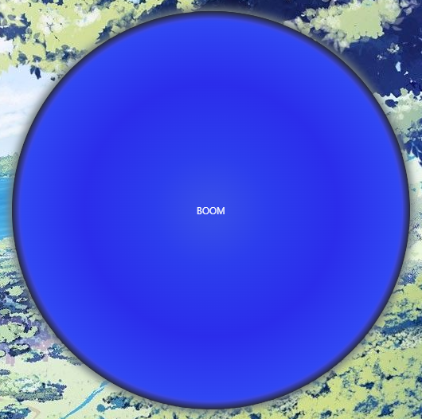

# Audio-Visualizer
This Audio Visualizer is *Math-Driven*

This audio visualizer translates audio frequencies into real-time visual patterns using mathematical functions as its foundation. 
It leverages trigonometry and signal analysis to create a dynamic, circular animation that reacts precisely to the rhythm, amplitude, and frequency spectrum of the audio being played. Shuffle on-click is implemented. 
The visualizer supports .mp3 files and is built with HTML, CSS, and JavaScript, designed for aesthetic clarity, the result is a geometric visualization that offers both- audio feedback and mathematical elegance.

This project started in 2019, during my internship at *Could Enterprise Systems*, where I created a bubble to mimic the waves from the sea (sea-themed project). 
Example picture of the bubble: 

[Visit CodePen for a live example.](https://codepen.io/Edijs-Gailis/pen/gbbVrbw)
